# gam-sso

**Intro**

This document will cover the details of how G-Suite federation can be added to provide access to various AWS accounts by enabling AWS SAML application in your G-Suite domain control panel and creating the proper IAM roles inside of the AWS accounts.

If you have already enabled the AWS SAML app in the past, you can skip the setup of the SAML app and simply  import the IDP information and update the schemas as discussed below.

This process is mostly documented on AWS blog https://aws.amazon.com/blogs/security/how-to-set-up-federated-single-sign-on-to-aws-using-google-apps/ however some of the items are outdated and it does not cover how to allow for extended session time over the 1 hour default.

In high level, here are the steps, each will be covered in more detail:

- Retrieve IDP metadata and ID retrieved from G-Suite application dashboard

- Install `gam` software

- Create Custom Schema in G-Suite to hold SSO parameters

- Enable AWS SAML app in G-Suite

- Create IAM IDP and IAM roles in AWS account(s)

- Programmatically update G-suite users with Role information using `gam` and `gammit`

**Prerequisites**

This document and package have been designed to work on Linux/Mac.  There's a 50/50 chance it will work as-is on Windows, but this hasn't been tested.  If anything, the line in the `utils.py` system that uses the `gam` default installation location may need to be adjusted.  Also, although this package is setup to be able to support `py.test` for Python, no tests have been implemented for the simple package.  Maybe in the future.

You should fork this repository.  There are data files in the `mapping` directory which is where you will store your various G-Suite domain users mappings.  Once forked and the setup instructions are followed, you will just need to `git pull` any changes to the files and run the `gammit` command to update users.  Any changes to user mappings should be re-committed to your forked repository.

**Retrieve IDP metadata and ID retrieved from G-Suite application dashboard**

- G-suite domain administrator on Vendor side to log into Google Admin console http://admin.google.com

- Navigate to `Security` → `SSO with Google as SAML IdP` or click this link after logging into console: https://admin.google.com/ac/security/ssocert?hl=en

- Note the `idpid` (also known as the Google `customer ID`) as shown here, you'll need it in a few steps (the value has been blocked for security)

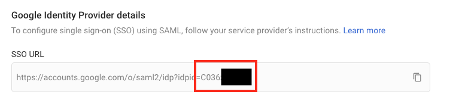

- Download the metadata at the bottom of the page, keep this file, it will uploaded to each AWS that will allow the G-Suite users access.  Keep this file secure, it contains sensitive information and should be deleted after uploading to the AWS accounts (this is covered later on.)


**Install `gam` software**

`GAM` is a software package utilizing a cli tool `gam` that will make changes to your G-Suite domain.  You must install `GAM` on your hostmachine and authenticate it to your domain.  The steps to install and authenticate `GAM` are out of scope of this document, but are covered on the `GAM` github page: https://github.com/jay0lee/GAM

- *Note: you must be a G-Suite domain admin in order to use `GAM` effectively for this tutorial*

**Create Custom Schema in G-Suite to hold SSO parameters**

- Now that we have the IDP information, it is time to add our custom schema to the Google Apps domain for use with our SAML integration.

- With `GAM` software, this is a very simple exercise, simply run the following command

`gam create schema SSO field duration type int64 endfield field role type string multivalued endfield`

- Assuming the command was successful, you should see the following message:

`Created user schema SSO`

**Enable AWS SAML app in G-Suite**

- Next, Navigate to "APPS" (https://admin.google.com/ac/apps) and select SAML APPS, add a new app of type `Amazon Web Services`

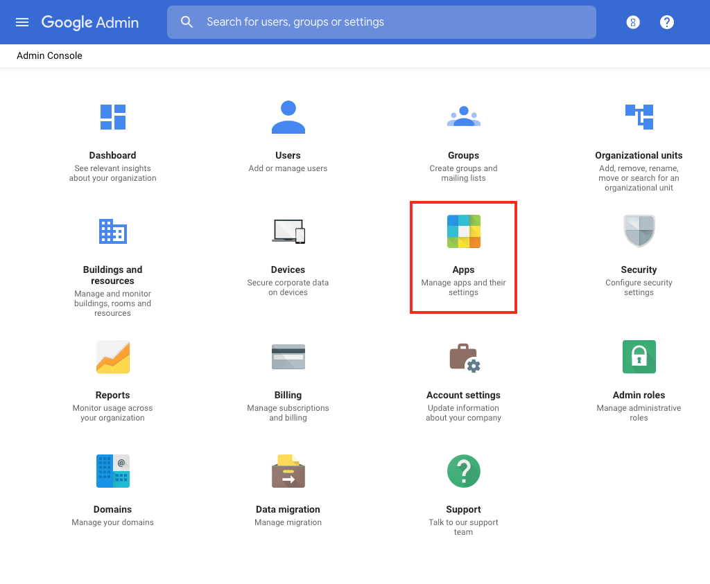
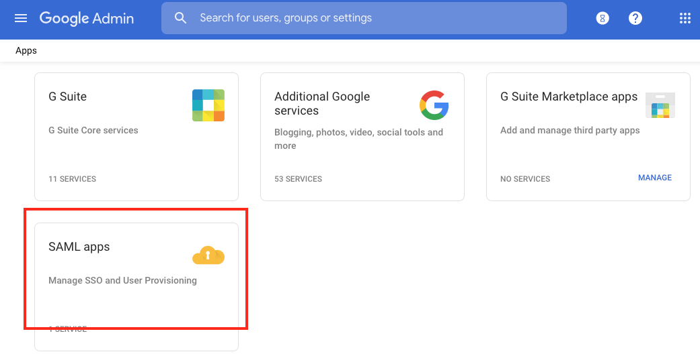
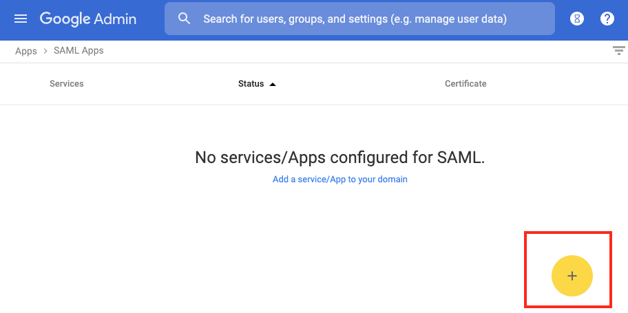
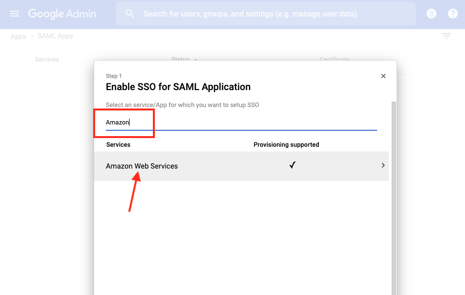

- On the next page, just click `NEXT`

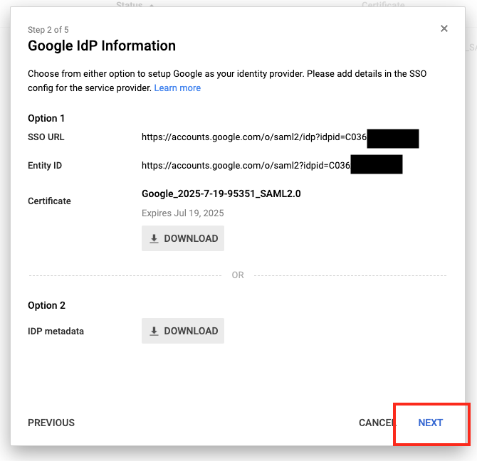

- On the next page, just click `NEXT`

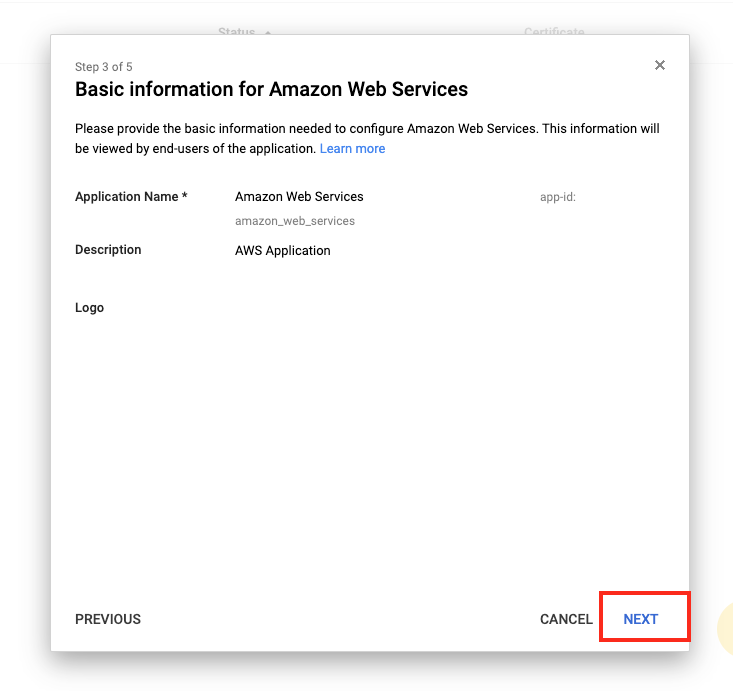

- On the next page, set the `Name ID Format` to `EMAIL` and click `NEXT`

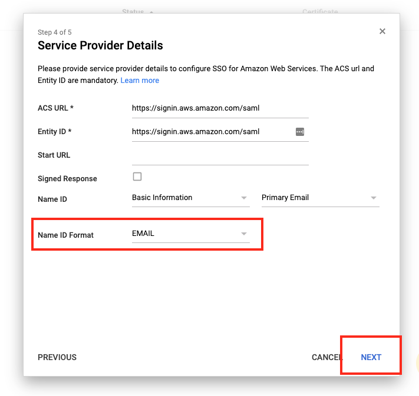

- On the next page, set the top 2 items as shown, select them as:
   - `Basic Information` → `Primary Email`
   - `SSO` → `role`
   - Then, click `ADD NEW MAPPING` and set it as shown:
     - The key will be: `https://aws.amazon.com/SAML/Attributes/SessionDuration` Set the value to `SSO` → `duration`
   - Click `FINISH` when done, then click `OK` on the final screen.

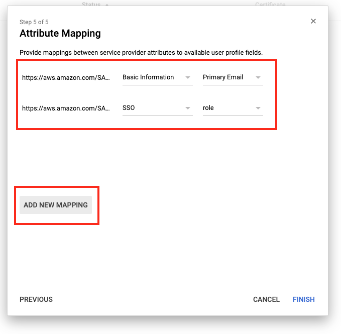
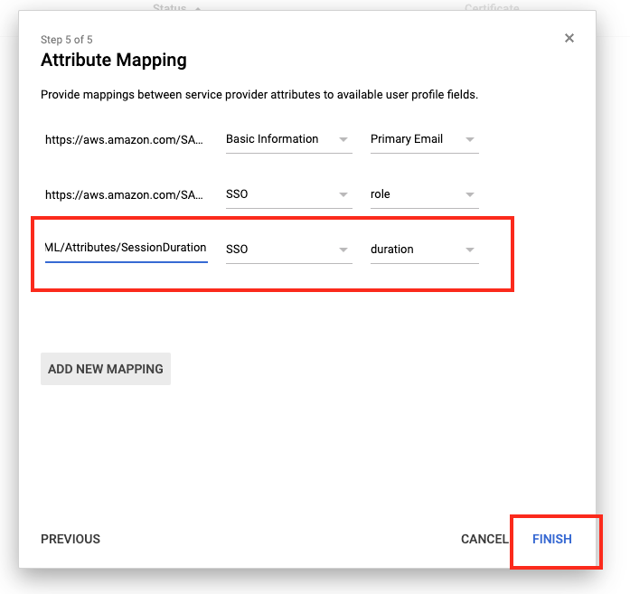
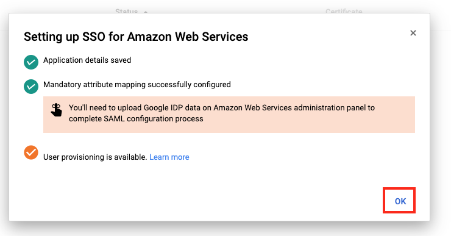

- The last thing to do is to turn this app on for everyone.  This will not give anyone access just yet, it simply makes the app available for your users to click inside of their G-Mail accounts.  If they have no access provided, then the app will simply tell them `Unauthorized`

  - Click `EDIT SERVICE`

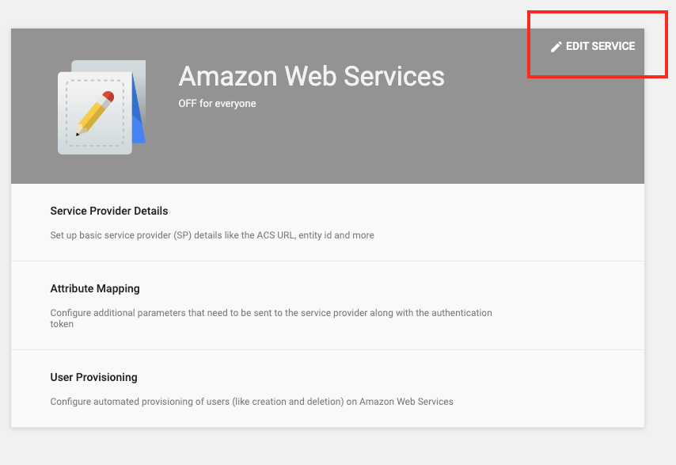

- Turn On for everyone and click `SAVE`

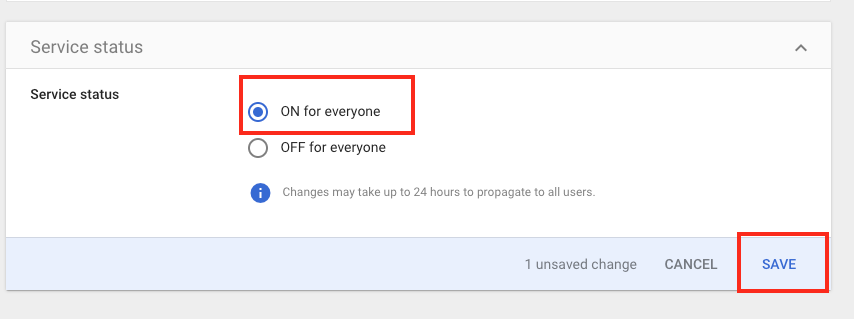

- Now your users should see Amazon Web Services in their app dropdown inside of Gmail, this may take a bit of time to appear, usually less than 30 minutes:

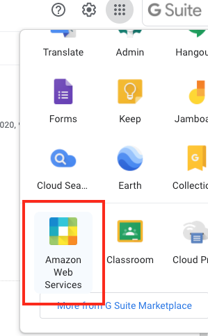

**Create IAM IDP and IAM roles in AWS account(s)**

Now that you have enabled the SAML app on your G-Suite domain, it is time to create the roles inside of your AWS account.

- Log into your AWS account with `administrator` or `root` access level.
- Go to `IAM` then click `Identity Providers`, finally click the `Create Provider` button.
- Set the type as `SAML`, give it a name, suggestion is to use the domain name as part of it, you may allow in more than one domain in the future!
- Upload the IDP metadata file you downloaded at the beginning of this processs.

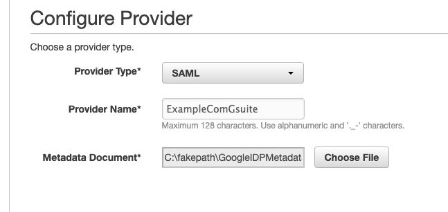

- Click the provider you just created on the list, and get the ARN of the provider, we'll use that later

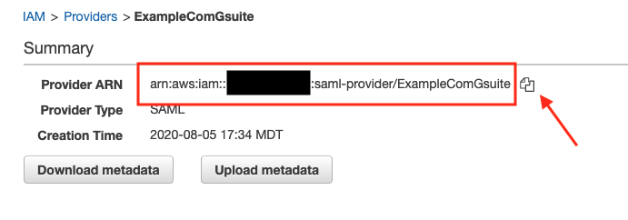

- Now, create roles as needed to give the required levels of access.  This is out of the scope of this document, but the idea is not everyone needs Administrator access, some people will be just fine with ReadOnly access etc.  So, create a role for each level of user.

- When creating the role, make sure to select the source as `SAML` and select the `IDP` we created in the step above.  Do this in the `IAM` -> `Roles` -> `Create Role` section of the console.

- Select the proper `IDP` and check `Allow programmatic and AWS Management Console Access` which will allow users to use this process for both logging into the console via a browser, or via the `aws cli` which will be covered later.

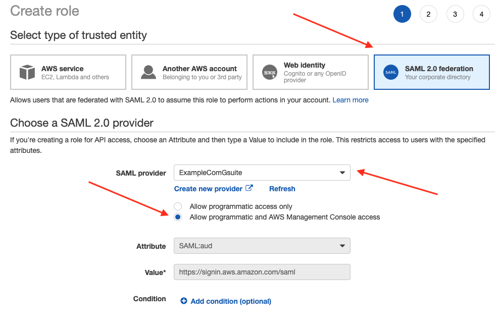

- Add the access policies you want these users to have to the role and save it.  Suggest to put the domain into the role name also, as a "Developer" from your domain may have more access than a "Developer" role if you allow outside G-Suite domains to access your accounts.

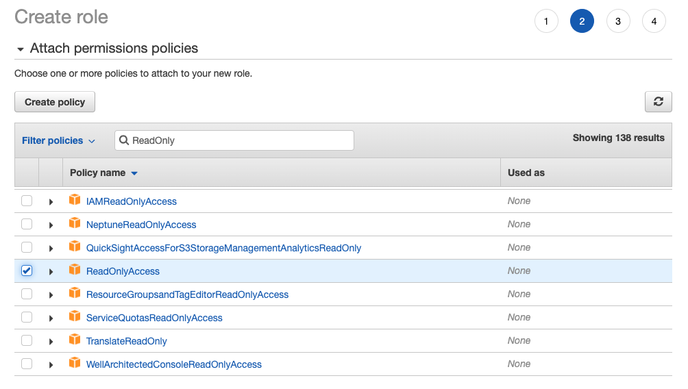
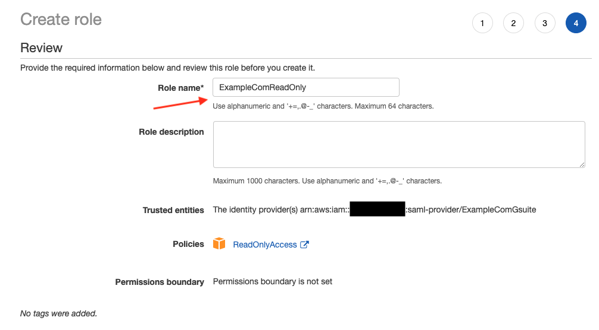

- After creating the role, click on it in the list and adjust the `Maximum Session Duration` to something more reasonable like 12 hours.  The `gammit` software is set to use 12 hours by default.  Having someone need to re-authenticate every hour is a pain point.

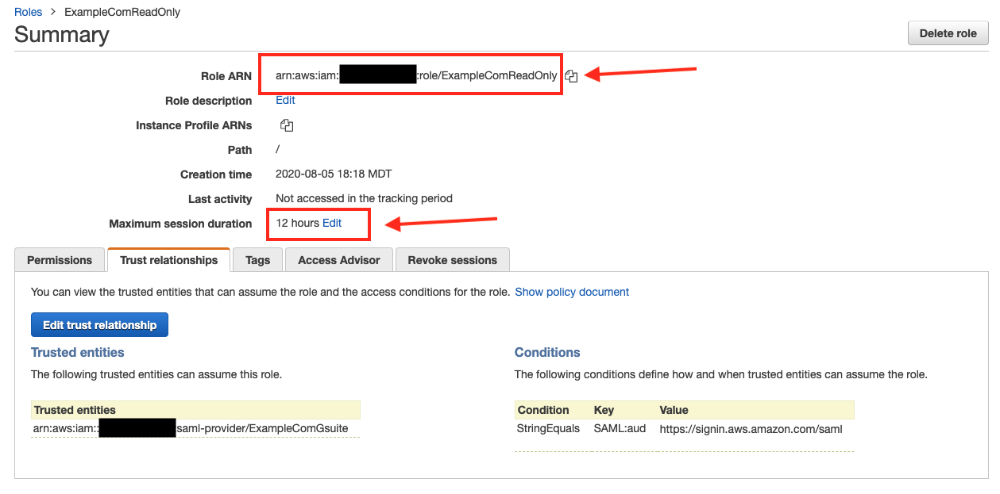

- Repeat the role creating process to make as many roles as needed, just make sure to keep note of all of their ARN values.

- *Note: if you were adding roles for an external G-Suite domain for a vendor, such as an external development team, you may want to restrict which emails on their side are allowed to come in via this role.  You can do this by adding more "conditions" in the `trust relationship` against the `SAML:sub` value by adding the list of emails of trusted developers on their side.  This way, they can't accidentally map the wrong person against your roles and grant a random person access.  If you're mapping your own users to your own G-Suite, this is less of a concern. See https://docs.aws.amazon.com/IAM/latest/UserGuide/reference_policies_iam-condition-keys.html#condition-keys-saml for more detail.*

**Programmatically update G-suite users with Role information using `gam` and `gammit`**

Now that the SAML app is setup on G-Suite, the IDP has been registered on your account(s) and the role(s) have been created, it's time to map the G-Suite users against the roles!

This is where the `gammit` package from this reposistory come into play.  `gammit` uses `gam` under the surface to modify users to have the appropriate roles you wish to assign them.

You could simply run multiple `gam` commands, but if you have several hundred users and/or roles, this quickly becomes difficult to manage.

See the `example.com.yml` file in the `mapping` folder for a starting point on configuring your users and role access.  Save this file as the G-Suite domain you are managing, such as `my-company-domain.com.yml` The file should be self explanitory.  It uses `predefined` variables for each role you wish to add, which require the ARN value of both the role and the IDP which you should have from the previously covered steps.  You may add as many roles on as many separate accounts as you wish.  If the user has more than one role available to them, they'll see a selection screen.

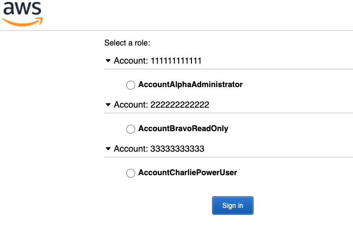

If you do have multiple accounts, and they only show the number of the account rather than the account name, go into your AWS account and go to the `IAM` dashboard and click `customize` giving your account a unique name.  This name will show up on the selection screen above, next to the account number making it easier to determine which account is which:

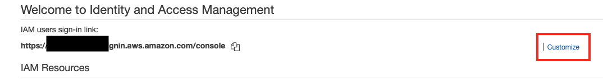

At this point, simply install the python package with the following command from the root of this repository:

`pip install -e python-pkg/gammit`

After the package installed, make sure `GAM` is already installed on your system, and simply run the following command, replacing the domain with your own domain name.

`gammit update -d {DOMAIN.com}`

You should see the output from the program which shows the users desired state being applied:

```bash
$ gammit update -d example.com
INFO: loading domain config example.com
INFO: processing user - john@example.com
 applying duration: 43200
 applying role: arn:aws:iam::111111111111:role/AccountAlphaAdministrator,arn:aws:iam::111111111111:saml-provider/ExampleComGsuite
 applying role: arn:aws:iam::222222222222:role/AccountBravoAdministrator,arn:aws:iam::222222222222:saml-provider/ExampleComGsuite
INFO: DONE - john@example.com
INFO: processing user - jane@example.com
 applying duration: 43200
 removing all roles
INFO: DONE - jane@example.com
```

*Note: that as shown in the `example.com.yml` file, if you want to remove a user's roles, you need to leave them in the file with the `Null` yaml syntax `~` as shown, and re-run `gammit` at least once.  If you simply remove them from the list, then they'll not be modified any longer leaving them with the previously applied access.  After you've nullified their roles with at least one `gammit` run, you're safe to remove them from the file permanently.*

That's it!

Feel free to raise any issues or questions in the issues section of this repository.
