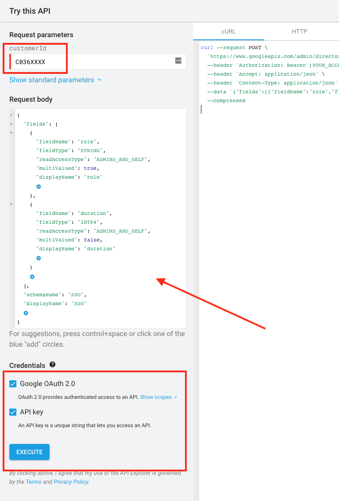
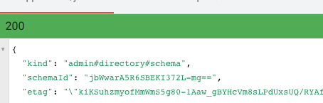
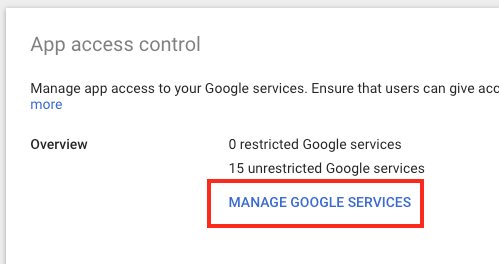
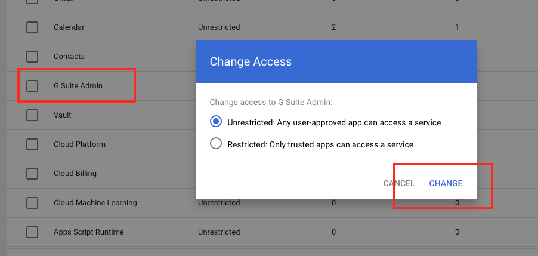

#gam-sso

**Intro**

This document will cover the details of how G-Suite federation can be added to provide access to various AWS accounts by enabling AWS SAML application in your G-Suite domain control panel and creating the proper IAM roles inside of the AWS accounts.

If you have already enabled the AWS SAML app in the past, you can skip the setup of the SAML app and simply  import the IDP information and update the schemas as discussed below.

This process is mostly documented on AWS blog https://aws.amazon.com/blogs/security/how-to-set-up-federated-single-sign-on-to-aws-using-google-apps/ however some of the items are outdated and it does not cover how to allow for extended session time over the 1 hour default.

In high level, here are the steps, each will be covered in more detail:

- Retrieve IDP metadata and ID retrieved from G-Suite application dashboard

- Update G-Suite custom schema attributes to support SAML keys (Role, RoleSession, Duration)

- Enable AWS SAML app in G-Suite

- Create IAM IDP and IAM roles in AWS account(s)

- Programmatically update G-suite users with Role information using `gam` and `gammit`

**Retrieve IDP metadata and ID retrieved from G-Suite application dashboard**

- G-suite domain administrator on Vendor side to log into Google Admin console http://admin.google.com

- Navigate to `Security` → `SSO with Google as SAML IdP` or click this link after logging into console: https://admin.google.com/ac/security/ssocert?hl=en

- Note the `idpid` as shown here, you'll need it in a few steps (the value has been blocked for security)


- Download the metadata at the bottom of the page, keep this file, it will uploaded to each AWS that will allow the G-Suite users access.  Keep this file secure, it contains sensitive information and should be deleted after uploading to the AWS accounts (this is covered later on.)


**Update G-Suite custom schema attributes to support SAML keys (Role, RoleSession, Duration)**

- Now that we have the IDP information, it is time to add our custom schema to the Google Apps domain for use with our SAML integration.

- Navigate to the API insert page: https://developers.google.com/admin-sdk/directory/v1/reference/schemas/insert#try-it

- On this page you will be pasting in the following payload and executing it:


```json
{
  "fields": [
    {
      "fieldName": "role",
      "fieldType": "STRING",
      "readAccessType": "ADMINS_AND_SELF",
      "multiValued": true,
      "displayName": "role"
    },
    {
      "fieldName": "duration",
      "fieldType": "INT64",
      "readAccessType": "ADMINS_AND_SELF",
      "multiValued": false,
      "displayName": "duration"
    }
  ],
  "schemaName": "SSO",
  "displayName": "SSO"
}
```

- For the customerId insert the idpid that you collected last step, paste the JSON above in the request body, make sure both checkboxes are checked, and hit EXECUTE at bottom. **NOTE: if you get a permission denied error, you likely have to update your API access permissions, see the CONDITIONAL steps that follow.**



- **CONDITIONAL**: if you got a permission denied message on the previous step, follow the below step, and then go back and try it again.  You'll know if it worked because you'll get a GREEN 200 box in the lower corner of the screen after executing:



- **CONDITIONAL**: To enable API permissions, go here: https://admin.google.com/ac/owl and click the MANAGE GOOGLE SERVICES link:



- **CONDITIONAL**: Make sure that `G Suite Admin app` is `unrestricted` and click CHANGE.  After this is done, if you received an error on the previous step, it should work now.



**Enable AWS SAML app in G-Suite**

- Next, Navigate to "APPS" (https://admin.google.com/ac/apps) and select SAML APPS, add a new app of type `Amazon Web Services`


- On the next page, just click `NEXT`


- On the next page, just click `NEXT`


- On the next page, set the `Name ID Format` to `EMAIL` and click `NEXT`


- On the next page, set the top 2 items as shown, select them as:
   - `Basic Information` → `Primary Email`
   - `SSO` → `role`
   - Then, click `ADD NEW MAPPING` and set it as shown:
     - The key will be: `https://aws.amazon.com/SAML/Attributes/SessionDurationSet` the value to `SSO` → `duration`
   - Click `FINISH` when done, then click `OK` on the final screen.


- The last thing to do is to turn this app on for everyone.  This will not give anyone access just yet, it simply makes the app available for your users to click inside of their G-Mail accounts.  If they have no access provided, then the app will simply tell them `Unauthorized`

  - Click `EDIT SERVICE`


- Turn On for everyone and click `SAVE`


- Now your users should see Amazon Web Services in their app dropdown inside of Gmail, this may take a bit of time to appear, usually less than 30 minutes:


**Create IAM IDP and IAM roles in AWS account(s)**

Now that you have enabled the SAML app on your G-Suite domain, it is time to create the roles inside of your AWS account.

- Log into your AWS account with `administrator` or `root` access level.
- Go to `IAM` then click `Identity Providers`, finally click the `Create Provider` button.
- Set the type as `SAML`, give it a name, suggestion is to use the domain name as part of it, you may allow in more than one domain in the future!
- Upload the IDP metadata file you downloaded at the beginning of this processs.


- Click the provider you just created on the list, and get the ARN of the provider, we'll use that later


- Now, create roles as needed to give the required levels of access.  This is out of the scope of this document, but the idea is not everyone needs Administrator access, some people will be just fine with ReadOnly access etc.  So, create a role for each level of user.

- When creating the role, make sure to select the source as `SAML` and select the `IDP` we created in the step above.  Do this in the `IAM` -> `Roles` -> `Create Role` section of the console.

- Select the proper `IDP` and check `Allow programmatic and AWS Management Console Access` which will allow users to use this process for both logging into the console via a browser, or via the `aws cli` which will be covered later.


- Add the access policies you want these users to have to the role and save it.  Suggest to put the domain into the role name also, as a "Developer" from your domain may have more access than a "Developer" role if you allow outside G-Suite domains to access your accounts.


- After creating the role, click on it in the list and adjust the `Maximum Session Duration` to something more reasonable like 12 hours.  The `gammit` software is set to use 12 hours by default.  Having someone need to re-authenticate every hour is a pain point.


- Repeat the role creating process to make as many roles as needed, just make sure to keep note of all of their ARN values.

- *Note: if you were adding roles for an external G-Suite domain for a vendor, such as an external development team, you may want to restrict which emails on their side are allowed to come in via this role.  You can do this by adding more "conditions" against the `SAML:sub` value by adding the list of emails of trusted developers on their side.  This way, they can't accidentally map the wrong person against your roles and grant a random person access.  If you're mapping your own users to your own G-Suite, this is less of a concern.*

**Programmatically update G-suite users with Role information using `gam` and `gammit`**

Now that the SAML app is setup on G-Suite, the IDP has been registered on your account(s) and the role(s) have been created, it's time to map the G-Suite users against the roles!

This is where `gam` and `gammit` come into play.  `gam` (https://github.com/jay0lee/GAM) is a powerful tool that handles most of the user creating/editing tasks on your G-Suite domain.
